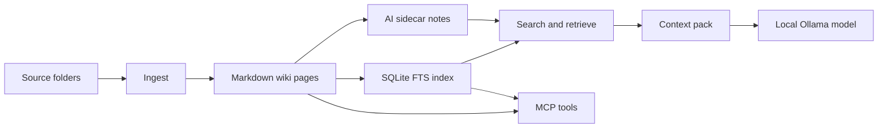

# Architecture

LLM Wiki MCP is intentionally local-first and simple to inspect.

## Layers

1. **Markdown truth layer**: the wiki pages are normal files under the selected vault.
2. **Index/cache layer**: SQLite full-text search accelerates retrieval but is rebuildable.
3. **CLI layer**: `llm-wiki` gives human-facing commands and shell mode.
4. **Python layer**: `LLMWikiContextEngine` lets another application request context programmatically.
5. **MCP layer**: `llm-wiki-mcp` exposes wiki tools to an MCP client.
6. **Local LLM layer**: `ask` uses an Ollama-compatible endpoint to synthesise answers from retrieved context.

See `docs/01_OVERVIEW_AND_ARCHITECTURE.md` for the fuller overview.
