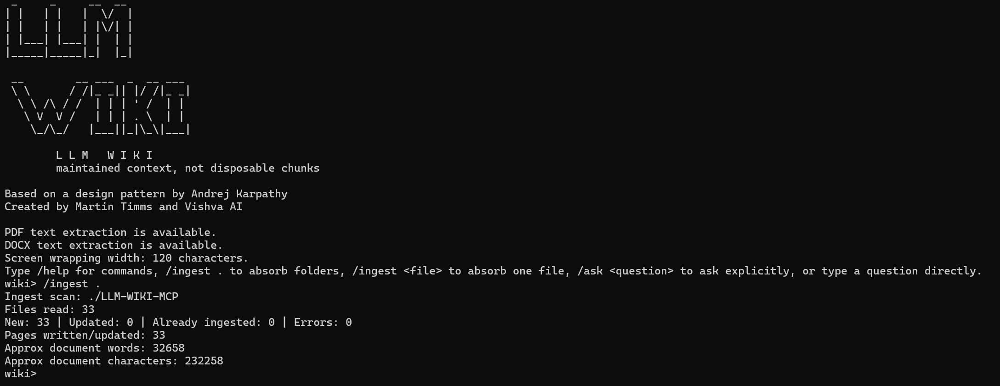

# LLM Wiki MCP

LLM Wiki MCP is a local-first Markdown knowledge system for people and agents. It turns a folder of notes, documents, examples, and project material into a durable wiki that can be searched, maintained, queried through a local LLM, and exposed as MCP tools.

Credits: based on a design pattern by Andrej Karpathy. Created by Martin Timms and Vishva AI.

The core idea is simple: Markdown remains the human-readable source of truth, SQLite provides a fast local index, and an Ollama-compatible local model can answer questions using retrieved wiki context.

## What it does

- Ingests Markdown, text, PDF, DOCX, and source-like files from a directory into wiki pages; `/ingest .` skips the active `wiki_vault/` automatically.
- Builds an indexed local knowledge base under `wiki_vault/`.
- Supports search, retrieval, context-pack generation, graph export, linting, repair, and provenance-aware re-ingestion.
- Provides an `ask` workflow that retrieves relevant wiki pages and sends them to the user's local Ollama agent.
- Can run as a command-line tool, a Python library, or an MCP stdio server.



## Install

```bash
git clone https://github.com/Electro-resonance/LLM-WIKI-MCP
cd LLM-WIKI-MCP
python -m venv .venv
source .venv/bin/activate   # Windows PowerShell: .venv\Scripts\Activate.ps1
pip install -e .[docs,mcp]
```

For a full setup walkthrough, see [INSTALL.md](INSTALL.md). Copy `llm_wiki_config.sample.jsonc` to `wiki_vault/llm_wiki_config.json` if you prefer a commented config file.

## Answer quality

`/ask` uses the configured Ollama model when available. If model synthesis returns a blank response, the CLI now falls back to an answer-first evidence summary: it gives a direct best-effort answer, states uncertainty, and then lists the wiki pages/tools used. This avoids returning only references when the local model is overloaded or returns an empty response.

## Quick start

Create a wiki vault, ingest the current project directory, configure Ollama, and ask a question:

```bash
llm-wiki --vault ./wiki_vault init
llm-wiki --vault ./wiki_vault ingest-dir . --pattern "*.md" --pattern "*.py" --pattern "*.txt" --pattern "*.rtf"
llm-wiki --vault ./wiki_vault config host http://localhost:11434
llm-wiki --vault ./wiki_vault config model llama3.2:3b
llm-wiki --vault ./wiki_vault ask "What does this project do?"
```

The interactive shell uses slash commands for explicit actions. Anything typed without a slash is treated as a natural-language `/ask` request:

```text
llm-wiki --vault ./wiki_vault shell
wiki> /ingest .
wiki> /ingest ./notes/idea.rtf
wiki> /ingest ./transcripts/session.txt
wiki> /config host http://localhost:11434
wiki> /config model llama3.2:3b
wiki> What does this project do?
wiki> Tell me about Karpathy's work!
```

Single-file ingest is useful when you only want to absorb one transcript, paper, note, or RTF brief without scanning the whole folder. Directory ingest intentionally skips the active `wiki_vault/` so generated wiki pages are not recursively absorbed as source documents.

Use a model that fits your machine. Smaller CPU-friendly models can work for ordinary Q&A; larger GPU-backed models usually give better synthesis.

### Screen width and wrapping

Terminal output is word-wrapped at 120 characters by default for readability. The wrapper inserts newlines at word boundaries, avoids splitting words, and leaves JSON/exported Markdown untouched.

```bash
llm-wiki --screen-width 120 --vault ./wiki_vault shell
llm-wiki --no-screen-wrap --vault ./wiki_vault ask "What does this project do?"
```

Inside the shell:

```text
wiki> /screen-width 120
wiki> /screen-width off
wiki> /wrap on
wiki> /wrap off
```

## Repository map

| Path | Purpose |
| --- | --- |
| `src/llm_wiki_mcp/` | Python package containing the CLI, context API, and MCP server implementation. |
| `llm_wiki_cli.py` | Direct launcher for the CLI when running from a checkout. |
| `llm_wiki_mcp_server.py` | Direct launcher for the MCP server. |
| `docs/` | User guide, architecture, tools, maintenance, examples, and research notes. |
| `examples/` | Small safe example inputs and demo command scripts. |
| `tests/` | Lightweight smoke/regression tests. |
| `wiki_vault/` | Empty placeholder directory. Runtime vault content is generated locally and ignored by Git. |
| `llm_wiki_config.sample.jsonc` | Commented sample config showing Ollama host/model options. |

## Main CLI commands

```bash
llm-wiki init
llm-wiki ingest-dir ./docs --pattern "*.md"
llm-wiki ingest-dir ./notes/idea.rtf
llm-wiki search "architecture"
llm-wiki retrieve "agentic ask workflow" --top-k 5
llm-wiki ask "How does ingestion work?"
llm-wiki config show
llm-wiki config host http://localhost:11434
llm-wiki config model llama3.2:3b
llm-wiki stats
llm-wiki lint
llm-wiki repair --apply
llm-wiki mermaid --output docs/wiki_graph.md
llm-wiki shell
```

## MCP server

Install the MCP optional dependency, then run:

```bash
llm-wiki-mcp server --vault ./wiki_vault
```

A client can also launch the checked-out script directly:

```json
{
  "mcpServers": {
    "llm-wiki-mcp": {
      "command": "python",
      "args": ["/absolute/path/to/llm_wiki_mcp_server.py", "server", "--vault", "/absolute/path/to/wiki_vault"]
    }
  }
}
```

## Documentation

Start with:

- [INSTALL.md](INSTALL.md)
- [docs/INDEX.md](docs/INDEX.md)
- [docs/01_OVERVIEW_AND_ARCHITECTURE.md](docs/01_OVERVIEW_AND_ARCHITECTURE.md)
- [docs/02_USER_GUIDE.md](docs/02_USER_GUIDE.md)
- [docs/03_FUNCTIONS_AND_TOOLS.md](docs/03_FUNCTIONS_AND_TOOLS.md)
- [docs/04_AGENTIC_ASK_AND_MEMORY.md](docs/04_AGENTIC_ASK_AND_MEMORY.md)
- [MCP_FUNCTIONS_LIST.md](MCP_FUNCTIONS_LIST.md)
- [CLI_TOOLS_LIST.md](CLI_TOOLS_LIST.md)
- [docs/books/README.md](docs/books/README.md)

## License

MIT. See [LICENSE](LICENSE).


## Conversation self-history

The CLI records completed `/ask` turns locally in the active vault. `/history` shows recent questions, answer previews, and token estimates. Agentic ask uses a bounded recent-history summary for follow-up context, while redacting local filesystem paths from prompts and screen answers. The live Ollama host/IP is shown to the local user for diagnostics; public docs use generic localhost examples.

## Configurable ask context

The interactive `/ask` pipeline now uses explicit context budgets so larger local models can receive fuller evidence instead of only short snippets. The defaults are intentionally generous for modern local LLMs:

```text
/context-settings
/context-settings context-budget 24000
/context-settings history-budget 3000
/context-settings source-budget 6000
/context-settings max-sources 8
/context-settings full-page-threshold 3
/debug-context tell me about this project
```

`/debug-context <question>` builds the exact prompt pack without calling Ollama. It shows the estimated prompt tokens, source titles, recent ask-history budget and the beginning of the context sent to the model. This is useful when tuning smaller CPU-only models or checking whether a broad question needs more source context.

## Interactive progress and command history

Long-running commands now show a same-line progress counter instead of printing one line per file. For large directories, `/ingest .` first displays `Scan: 123 files | filename.pdf` while it walks and filters the tree, then switches to `Ingest: 12/78 files` as files are absorbed, and finally to `Reindex: 12/45 pages` while the SQLite/FTS index is rebuilt. `/reindex` and `/notes-all` use the same carriage-return progress style, then clear the line before printing the final summary.

The interactive shell initialises persistent command history on startup. Use the up/down arrow keys to browse previous commands and Ctrl-R for reverse search where your terminal/readline backend supports it. History is stored inside the active vault as `.llm_wiki_history`.


## Long-book search windows

For very large PDF/book ingests, ordinary search now returns snippets centred around the actual hit rather than the beginning of the generated source page. This makes late-book matches usable in the CLI and MCP context.

Use `/search-following` when you want the matched page plus material that follows it:

```text
wiki> /search-following "recursive cognition" --pages 3 --limit 2
```

If extracted PDF page markers are available, the command returns the matched page plus the requested number of following pages. If no page markers are available, it returns a larger hit-centred character window.
