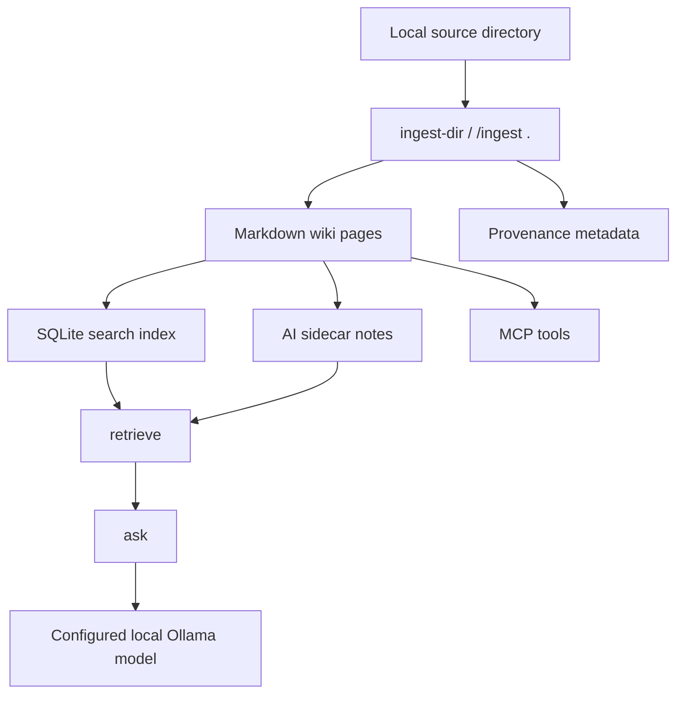

# Overview and Architecture

LLM Wiki MCP is a local-first knowledge system that lets humans and LLM agents work from the same maintained Markdown wiki.

## Purpose

The project exists to reduce the fragility of one-off RAG prompts. Instead of repeatedly retrieving fragments from a pile of files, useful source material is transformed into durable wiki pages with titles, links, provenance, and maintenance tools.

## Main flow

## Design principles

- Local-first: source material, generated wiki pages, config, and metrics live on the user's machine.
- Human-readable: Markdown is the durable layer, not a hidden database blob.
- Rebuildable: indexes and exports can be regenerated from the wiki.
- Agent-readable: the same knowledge is exposed through CLI, Python API, and MCP tools.
- Model-flexible: any suitable Ollama model can be selected through configuration.

## Runtime state

`wiki_vault/` is generated by the user. It may contain wiki pages, SQLite indexes, config, notes, runtime histories, and metrics. These files are ignored by Git so private/local knowledge does not leak into source control.
